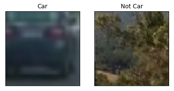
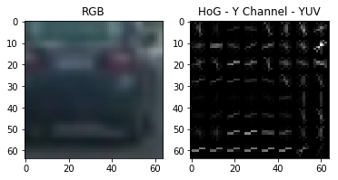
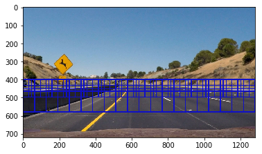
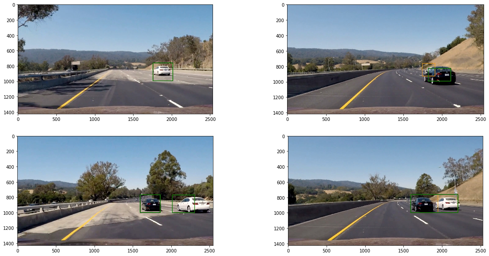

# The Vehicle Detection Project

The goals / steps of this project are the following:

* Perform a Histogram of Oriented Gradients (HOG) feature extraction on a labeled training set of images and train a classifier Linear SVM classifier
* Optionally, you can also apply a color transform and append binned color features, as well as histograms of color, to your HOG feature vector. 
* Note: for those first two steps don't forget to normalize your features and randomize a selection for training and testing.
* Implement a sliding-window technique and use your trained classifier to search for vehicles in images.
* Run your pipeline on a video stream (start with the test_video.mp4 and later implement on full project_video.mp4) and create a heat map of recurring detections frame by frame to reject outliers and follow detected vehicles.
* Estimate a bounding box for vehicles detected.

## Histogram of Oriented Gradients (HOG)

### 1. Loading the training data
First, the glob package is used to read in all the files in the data-set. 


```python
import glob
cars = glob.glob('data/vehicles/**/*.png')
notcars = glob.glob('data/non-vehicles/**/*.png')
```

Here is an example of one of each of the vehicle and non-vehicle classes:


```python
import matplotlib.pyplot as plt
import matplotlib.image as mpimg
%matplotlib inline

car = mpimg.imread(cars[11])
notcar = mpimg.imread(notcars[1])

plt.subplot(1,2,1)
plt.title('Car')
plt.imshow(car)
plt.xticks([])
plt.yticks([])
plt.subplot(1,2,2)
plt.imshow(notcar)
plt.title('Not Car')
plt.xticks([])
plt.yticks([])
plt.show()
```





### 2. HOG Parameters
Different colorspaces and HoG parameters were explored. The final configuration was chosen according to the one which gave the best test-set accuracy from the classifier. 


```python
# Color space (can be RGB, HSV, LUV, HLS, YUV, YCrCb)
color_space = 'YUV' 
# HOG: orientations
orient = 9 
# HOG: pixels per cell
pix_per_cell = 8 
# HOG cells per block
cell_per_block = 2 
# HOG: channels (can be 0, 1, 2, or "ALL")
hog_channel = 0 
# Binning: spatial binning dimensions
spatial_size = (16, 16) 
# Hostograms: number of histogram bins
hist_bins = 16
# Spatial features on or off
spatial_feat = True 
# Histogram features on or off
hist_feat = True
# HOG features on or off
hog_feat = True 
```

Here is an example using the Y channel of the YUV color space and HOG parameters of orientations=9, pixels_per_cell=(8, 8) and cells_per_block=(2, 2):


```python
import numpy as np
img = (car*255).astype(np.uint8)
from skimage.feature import hog
_, hog_image = hog(img[:,:,0],
                          orientations=orient,
                          pixels_per_cell=(pix_per_cell,pix_per_cell),
                          cells_per_block=(cell_per_block,cell_per_block),
                          visualise=True)
# Preview
plt.subplot(1,2,1)
plt.title('RGB')
plt.imshow(img, cmap='gray')
plt.subplot(1,2,2)
plt.imshow(hog_image, cmap='gray')
plt.title('HoG - Y Channel - YUV')
plt.show()
```





### 3. Training the classifier

A LinearSVC was used as the classifier for this project. The training process can be seen in code snippet below. The features are extracted and concatenated using functions defined in [`training.py`](training.py). Note: since the training data consists of PNG files, and because of how mpimg.imread loads PNG files, the image data is scaled up to 0-255 before being passed into the feature extractor. The features set includes HOG features, spatial features and color histograms. 


```python
import time
from training import *

print('Extracting features...')
cars = glob.iglob('data/vehicles/**/*.png')
notcars = glob.iglob('data/non-vehicles/**/*.png')
t0=time.time()
car_features = extract_features(cars, color_space=color_space, 
                        spatial_size=spatial_size, hist_bins=hist_bins, 
                        orient=orient, pix_per_cell=pix_per_cell, 
                        cell_per_block=cell_per_block, 
                        hog_channel=hog_channel, spatial_feat=spatial_feat, 
                        hist_feat=hist_feat, hog_feat=hog_feat)
notcar_features = extract_features(notcars, color_space=color_space, 
                        spatial_size=spatial_size, hist_bins=hist_bins, 
                        orient=orient, pix_per_cell=pix_per_cell, 
                        cell_per_block=cell_per_block, 
                        hog_channel=hog_channel, spatial_feat=spatial_feat, 
                        hist_feat=hist_feat, hog_feat=hog_feat)
print('Features extracted in ', round(time.time()-t0, 2),' sec')
```

    Extracting features...
    Features extracted in  23.34  sec


The training and testing sets were produced by splitting array stacks created from the extracted features. 


```python
# Create an array stack of feature vectors
X = np.vstack((car_features, notcar_features)).astype(np.float64)                        
# Define the labels vector
y = np.hstack((np.ones(len(car_features)), np.zeros(len(notcar_features))))
# Split on training and test sets
X_train, X_test, y_train, y_test = train_test_split(X, y, test_size=0.2)
```

The classifier is set up as a pipeline that includes a scaler to keep the scaling factors embedded in the model object when saved to a file. 


```python
# Create classifier
clf = Pipeline([('scaling', StandardScaler()),('classification', LinearSVC(loss='hinge'))])
# Train
t0=time.time()
clf.fit(X_train, y_train)
print('Linear SVC trained in', round(time.time()-t0, 2), 'sec')
```
   Linear SVC trained in 4.49 sec

One round of hard negative mining was also used to enhance the results. This was done by making copies of images that were identified as false positives and adding them to the training data set. This improved the performance of the classifier. The model obtained test accuracy of 98.45% with the test-set of 20% from the total data was saved to `models/clf_9845.pkl` file.


```python
from sklearn.externals import joblib

print('Test accuracy of the classifier:', round(clf.score(X_test, y_test), 4))
n_predict = 10
print('The classifier predicts:', clf.predict(X_test[0:n_predict]))
print('          for',n_predict, 'labels:', y_test[0:n_predict])

config = dict(color_space=color_space, 
            spatial_size=spatial_size, hist_bins=hist_bins, 
            orient=orient, pix_per_cell=pix_per_cell, 
            cell_per_block=cell_per_block, 
            hog_channel=hog_channel, spatial_feat=spatial_feat, 
            hist_feat=hist_feat, hog_feat=hog_feat)
joblib.dump({'model':clf, 'config':config}, 'models/clf_9845.pkl')
```

    Test accuracy of the classifier: 0.9845
    The classifier predicts: [ 0.  1.  1.  1.  0.  1.  0.  1.  1.  1.]
              for 10 labels: [ 0.  1.  1.  1.  1.  1.  0.  1.  1.  1.]
    ['models/clf_9845.pkl']


## Sliding Window Search

### 1. Defining windows
Sliding window search is implemented as a function `create_windows` in lines 141-147 of [`detection.py`](detection.py). The input to the function specifies both the window size, and the 'y' range of the image that the window is to be applied to. Several different scales were explored until the final set was selected based on classification performance. 


```python
import itertools
from detection import create_windows

image = mpimg.imread('test_images/test2.jpg')
pyramid = [((64, 64),  [400, 500]),
           ((96, 96),  [400, 500]),
           ((128, 128),[450, 600])]
image_size = image.shape[:2]
windows = create_windows(pyramid, image_size)
for p1, p2 in itertools.chain(*windows):
    cv2.rectangle(image, p1, p2, (15,15,200), 4)
plt.imshow(image)
plt.show()
```





### 2. Implementing video pipeline

The final image used the Y-channel of a YUV-image along with the sliding window approach shown above to detect windows of interest. These windows were used to create a heatmap which was then thresholded to remove false positives. This works well in a video stream where the heatmap is stacked over multiple frames. *`scipy.ndimage.measurements.label`* was then used to define clusters on this heatmap to be labeled as possible vehicles. The heatmap is created using the `update_heatmap` function in [`detection.py`](detection.py) in lines 171-186.
In the video pipeline the output of the label function was used as measurements for a Kalman Filter which estimated the corners of the bounding box.


```python
out_images = glob.glob('output_images/*.jpg')
print(len(out_images))
plt.figure(figsize=(20,10))
for i, fname in enumerate(out_images):
    img = mpimg.imread(fname)
    plt.subplot(2, 2, i+1)
    plt.imshow(img)
plt.show()
```

    4





## Video output 

### Below is the video produced with the proposed pipeline.

[](http://www.youtube.com/watch?v=4QCv3TjEuuE "Output video")


```python
print('Loading model ...')
data = joblib.load('models/clf_9845.pkl')
clf = data['model']
config = data['config']
color_space = config['color_space']
spatial_size = config['spatial_size']
hist_bins = config['hist_bins']
orient = config['orient']
pix_per_cell = config['pix_per_cell']
cell_per_block = config['cell_per_block']
hog_channel = config['hog_channel']
spatial_feat = config['spatial_feat']
hist_feat = config['hist_feat']
hog_feat = config['hog_feat']
print(config)
```

    Loading model ...
    {'color_space': 'YUV', 'spatial_feat': True, 'orient': 9, 'pix_per_cell': 8, 'hist_bins': 16, 'hog_channel': 0, 'spatial_size': (16, 16), 'hist_feat': True, 'cell_per_block': 2, 'hog_feat': True}


```python
# Import everything needed to edit/save/watch video clips
from pipeline import *
from moviepy.editor import VideoFileClip
from IPython.display import HTML

clear_cache()
params = {}
params['clf_config'] = config
params['clf'] = clf
params['cache_enabled'] = True
params['heatmap_cache_length'] = 25
params['heatmap_threshold'] = 10

print('Processing video ...')
clip2 = VideoFileClip('project_video.mp4')
vid_clip = clip2.fl_image(lambda i: process_image(i, params))
vid_clip.write_videofile('project_out.mp4', audio=False)
```

    Processing video ...
    [MoviePy] >>>> Building video project_out.mp4
    [MoviePy] Writing video project_out.mp4


    100%|█████████▉| 1260/1261 [02:25<00:00,  8.74it/s]


    [MoviePy] Done.
    [MoviePy] >>>> Video ready: project_out.mp4 
    


### Filtering and Thresholding

From all the windows marked as positive by the classifier the pipeline is creating a heatmap. To reduce false positives it was decided to use classifier's decision function rather than the predict method. By setting a threshold on the decision function many false detections were avoided. 
```python
dec = clf.decision_function(test_features)
prediction = int(dec > 0.75
```
The heatmap is then summed over 25 frames, and any pixels below a threshold of 10 are zeroed out. This excludes any detections that don't show up consistently in 10 out of the last 25 frames.

The process of tracking the vehicle, given a set of bounding boxes from the thresholded heatmap is performed by the VehicleTracker class in tracking.py. After the clusters were extracted from the heatmap using scipy.ndimage.measurements.label, the bounding boxes were passed in as measurements to a Kalman Filter.

The tracking process is mainly done by performing non-maximum suppression of the bounding boxes to remove duplicates and the following rules are used to identify possible candidates for tracking:
 - If there are no candidates being tracked, assume all the non-max suppressed bounding boxes as possible tracking candidates.
 - If there are candidates currently being tracked, compute the overlap between the measured bounding boxes as well as the distance between the centroids of these boxes and the candidates.
 - The measured bounding boxes are assigned to a candidates based on the overlap as well as the distance between the centroids.


The cleanup method in the VehicleTracker class removes stray vehicle candidates that haven't haven't been seen in a few frames or those that have gone beyond a pre-defined area of interest. This is implemented in lines 238-241 of tracking.py.

Each candidate also has an "age" value that is initially set to zero. Once the age hits -50, the variable is locked, and the candidate is assumed to be valid vehicle detection and permanently tracked even if it is not seen for a few frames. The Kalman Filter estimates the velocity of the bounding box and predicts the position whenever the measurements are lacking. A permanently tracked vehicle is only deleted once it goes outside a certain region-of-interest (horizon). This helps maintain the tracking even when vehicles are obscured.

The age is decremented by one any time the candidate has at least one measurement assigned to it. Conversely, the age is increased if no measurements are assigned to a candidate in a frame (assuming it's age > -50). Once the age reaches 5, the candidate is considered a false positive and removed.

There is also a threshold on the age at which a candidate is drawn on the image. An orange bounding box indicates that the covariance estimated by the Kalman filter has increased beyond a certain limit. This happens when a vehicle candidate is obscured behind another and hasn't been detected for a few frames.


## Discussion

 1. To get good results on the project video many parameters were manually fine-tuned based on the project video results. It can be assumed that the algorithm is over-fitted on the specific video and thus won’t yield as smooth results on videos with different lighting conditions and also other sceneries like cities.

 2. It is also based on the assumption of a fixed horizon. Therefore a steep hill will like cause trouble.

 3. Furthermore, vehicles with a high-speed difference to camera won’t be tracked correctly based on the fact that detections are averaged over several frames. So the detection boxes would lag behind the visible vehicle.
 
 4. The propose pipeline performs at ~200 ms per frame on MacBook Pro. Using CNN for the initial segmentation of the image might be much faster than a SVM classifier. This might enable real-time vehicle detection and tracking.


```python

```
